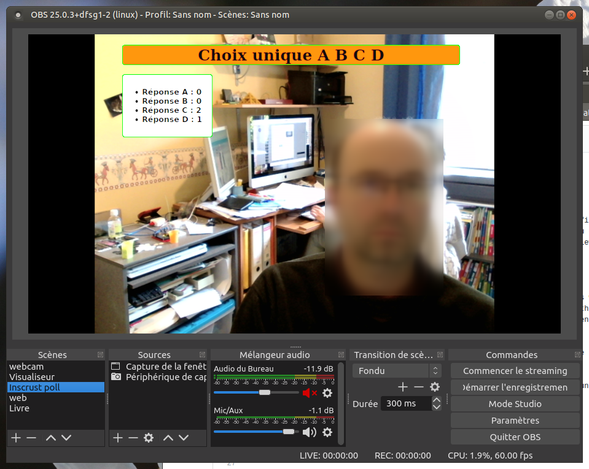

# livePoll
Interactive poll to use during youtube live sessions

- first you have to type the questions in the `liste_question.py` file
- there are generic questions Yes/No, True/False, choices by default but you can change them
- run the `views.py` script (python 3.7 minimum with flask module) to launch the app : `python3 views.py`

# python modules 
In order to launch the app, you will need the following modules installed with pip:
- flask
- qrcode
- requests

# URLS

The web server listens to http://your_server:5000/

There are three web pages :
- http://your_server:5000/ : address to give to your students. The questions will appear there
- http://127.0.0.1:5000/admin.html : the admin page allows you to select the active question
- http://127.0.0.1:5000/bilan : to see the results of the polls. The green backgroud allows incrustation inside OBS

If you want to access *bilan* and *admin.html* pages from another host, you need to add the allowed  IP addresses in the `ip_admin` list at the beginning of the `views.py` script.

# usage
- The students's page refreshes automagically. They don't have anything else to do but answering the questions when the teacher pushes them.
- the teacher chooses the questions from the admin page.
- the bilan page is designed to be displayed within OBS. The green background allows transparency using the *chroma key* filter.

The *qrcode* is automatically generated by fecting your public IP address. If you want a specific URL to be included instead, just type it in the `ip_pub` variable. The same goes for `ip_port` which is 5000 by default.